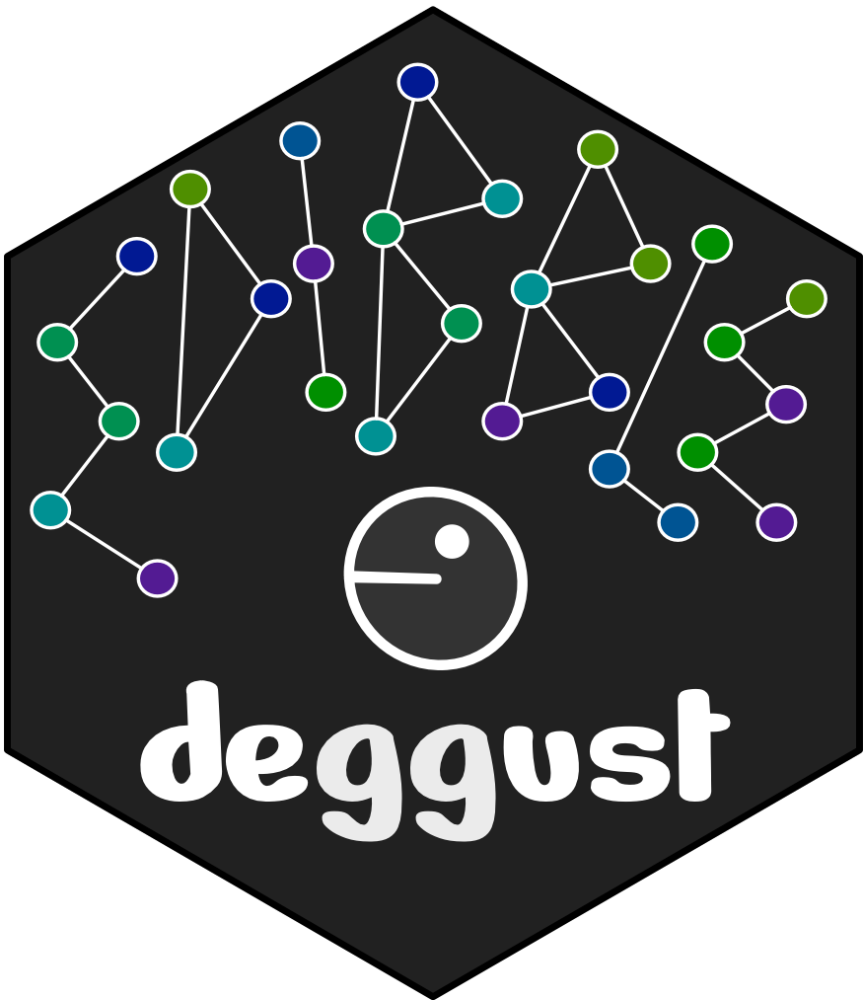

<!-- README.md is generated from README.Rmd. Please edit that file -->

```{r, include = FALSE}
knitr::opts_chunk$set(
  collapse = TRUE,
  comment = "#>",
  fig.path = "man/figures/README-",
  out.width = "100%"
)
```

# deggust 

<!-- badges: start -->
[](https://www.tidyverse.org/lifecycle/#experimental)
<!-- badges: end -->

The aim for deggust R-package is to visualise designs constructed from edibble R-package. The visualisation are ggplot graphics.


Right now, there's not much to see here. 

## Installation

The development version from [GitHub](https://github.com/) with:

``` r
# install.packages("devtools")
devtools::install_github("emitanaka/deggust")
```

## Related work

* `desplot` for visualising designs
* `ExploreModelMatrix` for exploring design matrix 
