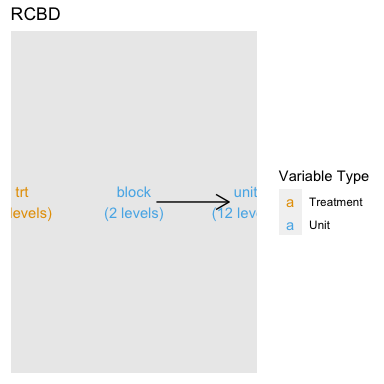
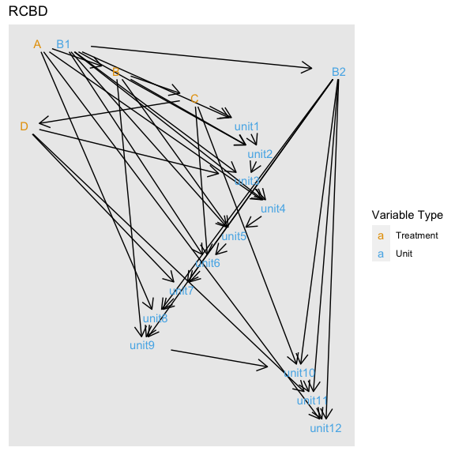

<!-- README.md is generated from README.Rmd. Please edit that file -->

# deggust 

<!-- badges: start -->

[](https://www.tidyverse.org/lifecycle/#experimental)
<!-- badges: end -->

The aim for deggust R-package is to visualise designs constructed from
edibble R-package. The visualisation are ggplot graphics.

**(WIP)**

## Installation

The development version from [GitHub](https://github.com/) with:

``` r
# install.packages("devtools")
devtools::install_github("emitanaka/deggust")
```

## Examples

``` r
library(ggplot2)
library(edibble)
library(deggust)

set.seed(1231) 

rcbd <- start_design(name = "RCBD") %>%
  set_units(block = c("B1", "B2"),
            unit = nested_in(block, 6)) %>%
  set_trts(trt = LETTERS[1:4]) %>%
  allocate_trts(~unit) %>%
  randomise_trts()
```

``` r
autoplot(rcbd)
#> Multiple parents. Unfolding graph
#> Multiple roots in graph. Choosing the first
#> Using `stress` as default layout
```

<!-- -->

``` r
autoplot(rcbd, view = "low")
#> Using `sugiyama` as default layout
```

<!-- -->

## Related work

  - `desplot` for visualising designs
  - `ExploreModelMatrix` for exploring design matrix
