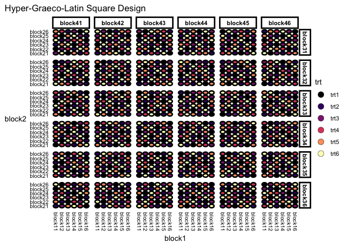

<!-- README.md is generated from README.Rmd. Please edit that file -->

# deggust 

<!-- badges: start -->

[](https://www.tidyverse.org/lifecycle/#experimental)
<!-- badges: end -->

The aim for deggust R-package is to visualise designs constructed from
the edibble R-package. The visualisation are ggplot graphics.

**(WIP)**

## Installation

The development version from [GitHub](https://github.com/) with:

``` r
# install.packages("devtools")
devtools::install_github("emitanaka/deggust")
```

## Recipe experimental designs

You can see `deggust::autoplot()` used in various edibble designs at
<https://emitanaka.org/edibble-book/cookbook.html>. Some samples are
below.

## Examples

``` r
library(edibble)
library(deggust)
#> Loading required package: ggplot2
```

``` r
fac <- takeout(menu_factorial(trt = c(3, 2)))
fac
#> start_design("Factorial Design") %>%
#>   set_units(unit = 42) %>%
#>   set_trts(trt1 = 3,
#>            trt2 = 2) %>%
#>   allot_trts(~unit) %>%
#>   assign_trts("random", seed = 440) %>%
#>   serve_table() 
#> 
#> # Factorial Design 
#> # An edibble: 42 x 3
#>          unit     trt1     trt2
#>  * <unit(42)> <trt(3)> <trt(2)>
#>  1     unit1     trt12    trt21
#>  2     unit2     trt11    trt22
#>  3     unit3     trt13    trt22
#>  4     unit4     trt11    trt21
#>  5     unit5     trt12    trt21
#>  6     unit6     trt11    trt22
#>  7     unit7     trt12    trt21
#>  8     unit8     trt13    trt22
#>  9     unit9     trt13    trt21
#> 10     unit10    trt13    trt21
#> # … with 32 more rows
```

``` r
autoplot(fac)
```

<!-- -->

``` r
hyper_graeco <- takeout(menu_hyper_graeco(t = 6))
hyper_graeco
#> start_design("Hyper-Graeco-Latin Square Design") %>%
#>   set_units(block1 = 6,
#>             block2 = 6,
#>             block3 = 6,
#>             block4 = 6,
#>             unit = ~block1:block2:block3:block4) %>%
#>   set_trts(trt = 6) %>%
#>   allot_trts(trt ~ unit) %>%
#>   assign_trts("random", seed = 253) %>%
#>   serve_table() 
#> 
#> # Hyper-Graeco-Latin Square Design 
#> # An edibble: 1,296 x 6
#>       block1    block2    block3    block4       unit      trt
#>  * <unit(6)> <unit(6)> <unit(6)> <unit(6)> <unit(1k)> <trt(6)>
#>  1   block11   block21   block31   block41     unit1      trt3
#>  2   block12   block21   block31   block41     unit2      trt6
#>  3   block13   block21   block31   block41     unit3      trt1
#>  4   block14   block21   block31   block41     unit4      trt5
#>  5   block15   block21   block31   block41     unit5      trt2
#>  6   block16   block21   block31   block41     unit6      trt4
#>  7   block11   block22   block31   block41     unit7      trt1
#>  8   block12   block22   block31   block41     unit8      trt3
#>  9   block13   block22   block31   block41     unit9      trt4
#> 10   block14   block22   block31   block41     unit10     trt2
#> # … with 1,286 more rows
```

``` r
autoplot(hyper_graeco)
```

<!-- -->

Automatic look into the design layout:

``` r
unit1 <- start_design(name = "One unit") %>%
    set_trts(trt = 4) %>%
    set_units(unit = 16) %>%
    allocate_trts(trt ~ unit) %>%
    randomise_trts() %>%
    serve_table()
#> Warning: `randomise_trts` is deprecated. Please use `assign_trts("random")`
#> instead.
#> Warning: `allocate_trts` is deprecated. Please use `allot_trts` instead.

autoplot(unit1)
```

<!-- -->

Easy to replace the unit shape:

``` r
autoplot(unit1, shape = "box")
```

<!-- -->

``` r
autoplot(unit1, shape = "triangle")
```

<!-- -->

``` r
autoplot(unit1, shape = "hexagon",
         text = element_text(size = 6, 
                             color = "gray",
                             face = "bold")) 
```

<!-- -->

## Related work

-   `desplot` for visualising designs
-   `ExploreModelMatrix` for exploring design matrix
-   `ez` for easy analysis and visualization of factorial experiments
