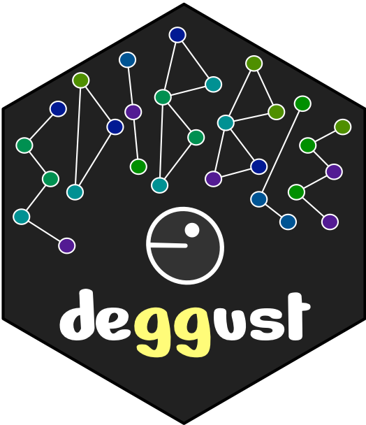

<!-- README.md is generated from README.Rmd. Please edit that file -->

# deggust 

<!-- badges: start -->

[](https://www.tidyverse.org/lifecycle/#experimental)
<!-- badges: end -->

The aim for deggust R-package is to visualise designs constructed from
edibble R-package. The visualisation are ggplot graphics.

**(WIP)**

## Installation

The development version from [GitHub](https://github.com/) with:

``` r
# install.packages("devtools")
devtools::install_github("emitanaka/deggust")
```

## Examples

``` r
library(ggplot2)
library(edibble)
library(deggust)

set.seed(1231) 

rcbd <- start_design(name = "RCBD") %>%
  set_units(block = c("B1", "B2"),
            unit = nested_in(block, 6)) %>%
  set_trts(trt = LETTERS[1:4]) %>%
  allocate_trts(~unit) %>%
  randomise_trts()
```

``` r
autoplot(rcbd)
#> Multiple parents. Unfolding graph
#> Multiple roots in graph. Choosing the first
#> Using `stress` as default layout
```

<!-- -->

``` r
autoplot(rcbd, view = "low")
#> Using `sugiyama` as default layout
```

<!-- -->

## Proof of concepts

``` r
df <- serve_table(rcbd)
```

Something like below should be the result of `autoplot(df)` with units
fixed as nesting labels.

``` r
grcbd <- ggplot(df, aes(unit, block, fill = trt)) +
  geom_tile(color = "black", size = 1.3) +
  coord_equal()

grcbd
```

<!-- -->

Below modifies from the “square tile” to the image provided by the user.

``` r
grcbd + geom_units(aes(unit), image = "person.png")
```

``` r
library(ggraph)
#> Warning: package 'ggraph' was built under R version 4.0.2
library(igraph)
#> Warning: package 'igraph' was built under R version 4.0.2
#> 
#> Attaching package: 'igraph'
#> The following object is masked from 'package:edibble':
#> 
#>     traits
#> The following objects are masked from 'package:stats':
#> 
#>     decompose, spectrum
#> The following object is masked from 'package:base':
#> 
#>     union
graph <- make_empty_graph(n = 0) %>% 
  add_vertices(nv = nrow(df),
               attr = df)

ggraph(graph, layout = "manual",
            x = rep(1:2, each = nrow(df) / 2),
            y = rep(1:(nrow(df)/2), 2)) + 
  #geom_node_circle(aes(r = 0.1), fill = "red") +
  #geom_node_point() + 
  geom_node_tile(aes(width = 1, height = 1, fill = trt)) + 
  geom_node_text(aes(label = unit)) + 
  coord_equal()
```

<!-- -->

## Related work

  - `desplot` for visualising designs
  - `ExploreModelMatrix` for exploring design matrix
  - `ez` for easy analysis and visualization of factorial experiments
